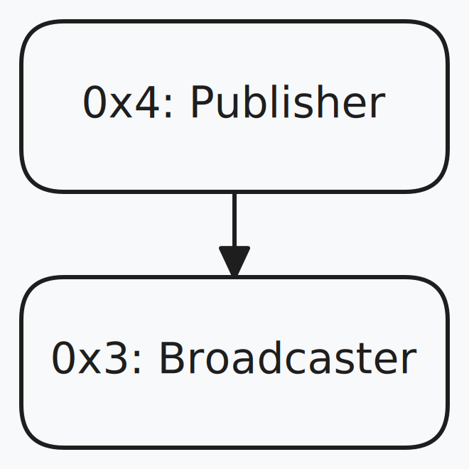
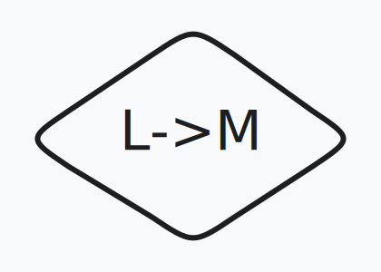
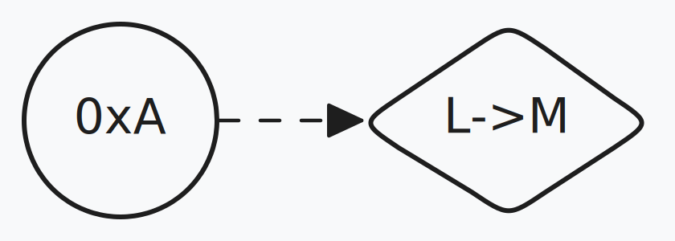
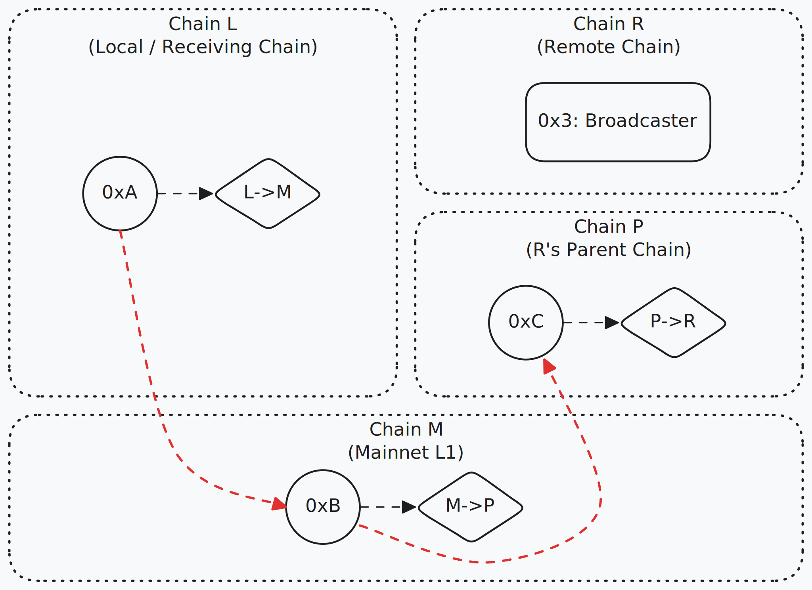
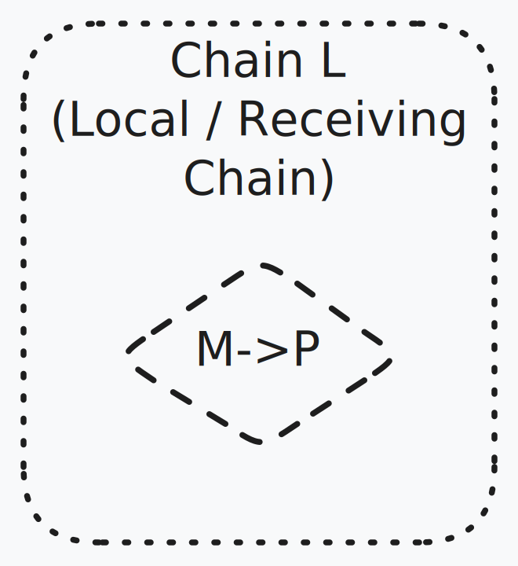
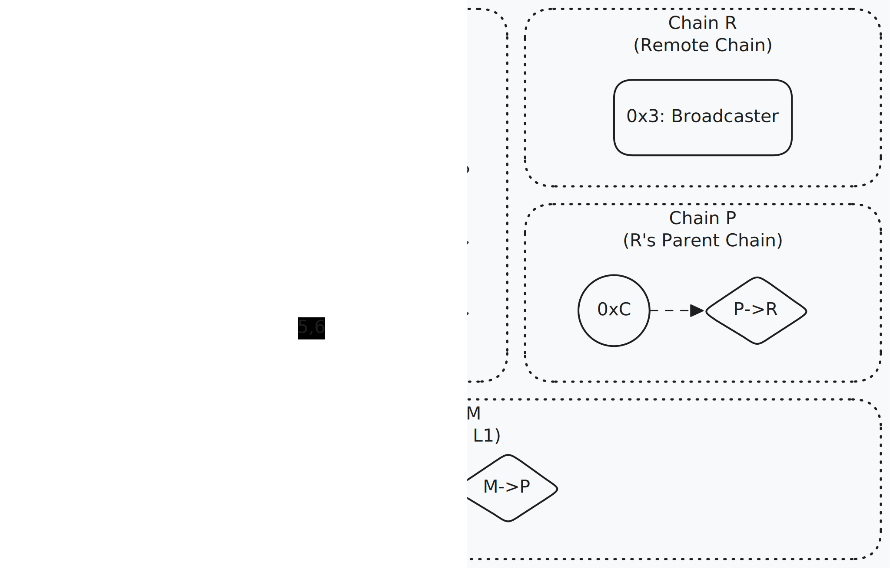

## Abstract

This ERC defines a standardized protocol for cross-rollup message broadcasting and reception via storage proofs. Users can broadcast messages on a source chain, those messages can then be read by one or many other chains, as long as those chains share a common ancestor chain with the source chain. The standard enables trustless message passing across rollups hosted on different rollup architecture stacks.

## Motivation

The Ethereum ecosystem is experiencing a rapid growth in the number of rollup chains. As the number of chains grows, the experience becomes more fragmented for users, creating a need for trustless "interop" between rollup chains. These rollup chains, hosted on different rollup stacks, have heterogenous properties, and as yet there does not exist a simple, trustless, unified mechanism for sending messages between these diverse chains.

Many classes of applications could benefit from a unified system for broadcasting messages across chains. Some examples include:

- **Intent-Based Protocols:** These protocols enable "fillers" to quickly execute crosschain actions on behalf of users, followed by slower, trustless messaging to settle these actions. However, due to the lack of a simple, unified interface for sending settlement messages, intent protocols often develop proprietary methods. This raises adoption barriers for fillers, integrators, and new protocols. A pluggable, standardized messaging solution that works across rollup stacks would allow developers and standards authors to focus on other components of the intent stack, such as fulfillment constraints, order formats, and escrow.
- **Governance of multichain apps:** Multichain apps often have a single chain where core governance contracts are located. A standardized broadcast messaging system simplifies the dissemination of proposal results to all instances of a multichain app.
- **Multichain Oracles:** Some classes of oracles may benefit from being able to post their data to a single chain, while having that same data easily accessible across many other chains.

## Specification

The key words "MUST", "MUST NOT", "REQUIRED", "SHALL", "SHALL NOT", "SHOULD", "SHOULD NOT", "RECOMMENDED", "MAY", and "OPTIONAL" in this document are to be interpreted as described in RFC 2119.

### High Level
There is a singleton Receiver and Broadcaster contract deployed to each chain. Broadcasters are responsible for storing messages. Receivers are responsible for verifying proofs of Broadcasters' storage on remote chains. 

A Receiver learns about the contents of a Broadcaster on another chain by using storage proofs to unwrap a finalized block hash of the Broadcaster's chain. The Receiver verifies these finalized block hashes using storage proofs of the canonical bridges of these remote rollup chains. It can do this iteratively to learn about the contents of a Broadcaster that is many hops away from the Receiver, as long as the rollups share a common ancestor chain (like Ethereum).

Two prominent issues with this approach are that it's inflexible and brittle. In practice, rollups have heterogenous architectures - they store finalized block hashes in different places in their rollup contracts making it difficult for a hard coded storage proof approach to support different locations of block hashes. In the same vein, rollups can upgrade their contracts and move the location of block hashes, breaking the ability of the Receiver to read from the Broadcaster. This proposal addresses these two issues by introducing 'Pointer' contracts that allow the rollup chain owners to dynamically update and set finalized block hash locations for their contracts.

### Compatibility Requirements

Chains must satisfy the following conditions to be compatible with the system:

- Must store finalized block hashes on the parent chain
- Must store parent chain block hashes in child chain state
- Must be EVM equivalent with L1. BlockHashProvers are deployed as copies on many chains, so need to behave the same on all those chains

### Constants

```solidity
<!--@embed:contracts/standard/Constants.sol:4:-->
```

### Broadcaster

The Broadcaster is responsible for storing messages in state to be read by Receivers on other chains. Callers of the Broadcaster are known as Publishers. The Broadcaster stores only 32 byte messages.

The Broadcaster does not accept duplicate messages from the same publisher.

<div align="center">


*Figure 1: A Publisher at address 0x4 calling a Broadcaster at address 0x3*
</div>

```solidity
<!--@embed:contracts/standard/interfaces/IBroadcaster.sol:4:-->
```

### BlockHashProvers
BlockHashProvers prove a unidirectional link between two chains that have direct access to each other's finalized blocks. The chains in this link are called the **home chain** and the **target chain**. BlockHashProvers are responsible for verifying storage proofs to prove the existence of finalized target block hashes in the state of the home chain.

Since the BlockHashProvers are unidirectional, each type of chain needs to implement two: 
* One whose home is the child chain and target is the parent chan.
* One whose home is the parent chain and target is the child chain.

BlockHashProvers MUST ensure that they will have the same deployed code hash on all chains.

<div align="center">


*Figure 2: A `BlockHashProver` with home chain L and target chain M*
</div>

```solidity
<!--@embed:contracts/standard/interfaces/IBlockHashProver.sol:4:-->
```

### BlockHashProverPointers

BlockHashProvers can be used to get or verify target block hashes, however since their verification logic is immutable, changes to the structure of the home or target chain can break the logic in these Provers. A BlockHashProverPointer is a Pointer to a BlockHashProver which can be updated if proving logic needs to change.

BlockHashProverPointers are used to reference BlockHashProvers as opposed to referencing Provers directly. To that end, wherever a BlockHashProver is deployed a BlockHashProverPointer needs to be deployed to reference it.

BlockHashProverPointers allow a permissioned party to update the Prover reference within the Pointer. Choosing which party should have the permission to update the Prover reference should be carefully considered. The general rule is that if an update to the target or home chain could break the logic in the current Prover, then the party, or mechanism, able to make that update should also be given permission to update the Prover. See [Security Considerations](#security-considerations) for more information on BlockHashProverPointer ownership and updates.

When updating a BlockHashProverPointer to point to a new BlockHashProver implementation:
* The home and target chain of the new BlockHashProver MUST be identical to the previous BlockHashProver.
* The new BlockHashProver MUST have a higher version than the previous BlockHashProver.

BlockHashProverPointers MUST store the code hash of the BlockHashProver implementation in slot `BLOCK_HASH_PROVER_POINTER_SLOT`.

<div align="center">


*Figure 3: A `BlockHashProverPointer` at address 0xA pointing to a `BlockHashProver` with home chain L and target chain M*
</div>

```solidity
<!--@embed:contracts/standard/interfaces/IBlockHashProverPointer.sol:4:-->
```

### Routes

A route is a relative path from a Receiver on a local chain to a remote chain. It is constructed of many single degree links dictated by BlockHashProverPointers. Receivers use the BlockHashProvers that the Pointers reference to verify a series of proofs to obtain the remote chain's block hash. A route defined by the list of Pointer addresses on their home chains.

A valid route MUST obey the following:
- Home chain of the `route[0]` Pointer must equal the local chain
- Target chain of the `route[i]` Pointer must equal home chain of the `route[i+1]` Pointer

<div align="center">


*Figure 4: A route [0xA, 0xB, 0xC] from chain L to chain R*<br/>
*Chain L is an L2, Chain M is Ethereum Mainnet, Chain P is another L2, and Chain R is an L3 settling to Chain P* 
</div>

### Identifiers

Accounts on remote chains are identified by the route taken from the local chain plus the address on the remote chain. The Pointer addresses used in the route, along with the remote address, are cumulatively keccak256 hashed together to form a **Remote Account ID**.

In this way any address on a remote chain, including Pointers and Broadcasters, can be uniquely identified relative to the local chain by their Remote Account ID.

ID's depend on a route and are therefore always *relative* to a local chain. In other words, the same account on a given chain will have different ID's depending on the route from the local chain.

The Remote Account ID is defined as `accumulator([...route, remoteAddress])`

```solidity
function accumulator(address[] memory elems) pure returns (bytes32 acc) {
    for (uint256 i = 0; i < elems.length; i++) {
        acc = keccak256(abi.encode(acc, elems[i]));
    }
}
```

In Figure 4:
- The Remote Account ID of Broadcaster at `0x3` is `accumulator([0xA, 0xB, 0xC, 0x3])`
- The Remote Account ID of BlockHashProverPointer `0xC` is `accumulator([0xA, 0xB, 0xC])`.

### BlockHashProverCopies

BlockHashProverCopies are exact copies of BlockHashProvers deployed on non-home chains. When a BlockHashProver code hash is de-referenced from a Pointer, a copy of the BlockHashProver may be used to execute its logic. Since the Pointer references the prover by code hash, a local copy of the Prover can be deployed and used to execute specific proving logic. The Receiver caches a map of `mapping(bytes32 blockHashProverPointerId => IBlockHashProver blockHashProverCopy)` to keep track of BlockHashProverCopies. 

<div align="center">


*Figure 5: A BlockHashProverCopy of BlockHashProver M->P on chain L*
</div>

### Receiver

The Receiver is responsible for verifying 32 byte messages deposited in Broadcasters on other chains. The caller provides the Receiver with a route to the remote account and proof to verify the route.

<div align="center">


*Figure 6: Example of a Receiver reading a message from a Broadcaster on chain R*
</div>

The calls in Figure 6 perform the following operations:
1. Subscriber calls `IReceiver::verifyBroadcastMessage`, passing route `[0xA, 0xB, 0xC]`, proof data, message, publisher.
1. Receiver calls `IBlockHashProverPointer(0xA)::implementationAddress` to get the address of BlockHashProver L->M
1. Receiver calls `IBlockHashProver(Prover L->M)::getTargetBlockHash`, passing input given by Subscriber to get a block hash of chain M.
1. Receiver calls `IBlockHashProver(Prover Copy M->P)::verifyTargetBlockHash`, passing chain M's block hash and proof data by Subscriber to get a block hash of chain P.
1. Receiver calls `IBlockHashProver(Prover Copy P->R)::verifyTargetBlockHash`, passing chain P's block hash and proof data by Subscriber to get a block hash of chain R.
1. Finally, Receiver calls `IBlockHashProver(Prover Copy P->R)::verifyStorageSlot`, passing input given by Subscriber to get a storage slot from the Broadcaster. The Receiver returns the Broadcaster's Remote Account ID and the message's timestamp to Subscriber.

```solidity
<!--@embed:contracts/standard/interfaces/IReceiver.sol:6:-->
```

## Rationale

### Broadcast vs Unicast

A contract on any given chain cannot dictate which other chains can and cannot inspect its state. Contracts are naturally broadcasting their state to anything capable of reading it. Targeted messaging applications can always be built on top of a broadcast messaging system.

See [Publisher and Subscriber Burn and Mint Bridge](#example-publisher-and-subscriber-burn-and-mint-bridge) for an example of a unicast application.

### Using Storage Proofs

Message reading uses storage proofs. An alternative to this would be to pass messages (perhaps batched) via the canonical bridges of the chains. However storage proofs have some advantages over this method:

- They only require gas tokens on the chains where the message is sent and received, none on the chains on the route in between.
- Batching by default. Since storage slots share a common storage root, caching the storage root allows readers to open adjacent slots at lower cost. This provides a form of implicit batching, whereas canonical bridges would need to create a form of explicit batching.
- If the common ancestor of the two chains is Ethereum, sending a message using the canonical bridges would require sending a transaction on Ethereum, which would likely incur a high cost.

#### Cost Comparison
Here we compare the cost of using storage proofs vs sending messages via the canonical bridge, where the parent chain is Ethereum. Here, we will only consider the cost of the L1 gas as we assume it to dominate the L2 gas costs.

Each step along the route requires 1 storage proof. These proofs can be estimated at roughly 6.5k bytes. These proofs will likely be submitted on an L2/L3 and therefore be included in blobs on the L1, which have a fluctuating blob gas price. Since rollups can dynamically switch between calldata and blobs, we can work out a maximum amount of normal L1 gas that could be using the standard cost of calldata as an upper bound. Post Pectra, the upper bound for non-zero-byte calldata is 40 gas per byte, which for 6.5k bytes equates to 260,000 L1 gas.

We want to compare this to sending a single message via a canonical rollup bridge, which is either a parent->child or child->parent message. This estimate is dependent on specific implementations of the bridge for different rollup frameworks, but we estimate it to be around 150,000 gas.

This puts the upper bound of the storage proof to be around 2x that of the canonical bridge, but in practice this upper bound is rarely reached. On top of that, the Receiver can implement a caching policy allowing many messages to share the same storage proofs.

### Caching
This ERC does not currently describe how the Receiver can cache the results of storage proofs to improve efficiency. In brief, once a storage proof is executed it never needs to be executed again, and instead the result can be stored by the Receiver. This allows messages that share the same, or partially the same, route to share previously executed storage proofs and instead lookup the result. As an example we can consider the route between two L2s:
1. Ethereum block hash is looked up directly on L2' by the Receiver on L2'
2. The block hash of L2'' is proven using a storage proof
3. The account of root of the Broadcaster on L2'' is proven using a storage proof
4. The slot value in the Broadcaster account is proven using a storage proof
The result of everything up to step 4 in this process can be stored in a Receiver cache and re-used by any unread messages in the Broadcaster. The Receiver can even go further and cache individual nodes in the account trie to make step 4. cheaper for previous messages.

### Using Routes in Identifiers

Chains are often identified by chain ID's. Chain ID's are set by the chain owner so they are not guaranteed to be unique. Using the addresses of the Pointers is guaranteed to be unique as it provides a way to unwrap the nested block hashes embedded in the state roots. A storage slot on a remote chain can be identified by many different remote account ID's, but one remote account ID cannot identify more than one storage slot.

### BlockHashProvers, Pointers, and Copies

#### BlockHashProvers
Each rollup implements unique logic for managing and storing block hashes. To accommodate this diversity, BlockHashProvers implement chain-specific procedures. This flexibility allows integration with each rollup's distinct architecture.

The BlockHashProver handles the final step of verifying a storage slot given a target block hash to accomodate rollups with differing state trie formats.

#### BlockHashProverPointers
Routes reference BlockHashProvers through Pointers rather than directly. This indirection is crucial because:
- Chain upgrades may require BlockHashProver redeployments
- Routes must remain stable and valid across these upgrades - ensuring in-flight messages are not broken
- Pointers maintain route consistency while allowing BlockHashProver implementations to evolve

#### BlockHashProverCopies
Since BlockHashProverPointers reference BlockHashProvers via their code hash, a copy of the BlockHashProver can be deployed anywhere and reliably understood to contain the same code as that referenced by the Pointer. This allows the Receiver to locally use the code of a BlockHashProver whose home chain is a remote chain.

## Security Considerations

### Chain Upgrades
If a chain upgrades such that a BlockHashProver's `verifyTargetBlockHash` or `getTargetBlockHash` functions might return data besides a finalized target block hash, then invalid messages could be read by a `Receiver`. For instance, if a chain stores its block hashes on the parent chain in a specific mapping, and that storage location is later repurposed, then an old BlockHashProver might be able to pass along an invalid block hash. It is therefore important that either:
* the BlockHashProver is written in such a way to detect changes like this
* the owner who is able to repurpose these storage locations is aware of the BlockHashProver and ensures they don't break it

### BlockHashProverPointer Ownership / Updates
A malicious BlockHashProverPointer owner can DoS or forge messages. However, so can the chain owner responsible for setting the location of historical parent/child block hashes. Therefore it is expected that this chain owner be the same as the owner of the BlockHashProverPointer so as not to introduce additional risks.

* If the target chain of the referenced BlockHashProver is the parent chain, the home chain owner is expected to be the BlockHashProverPointer's owner.
* If the target chain of the referenced BlockHashProver is the child chain, the target chain owner is expected to be the BlockHashProverPointer's owner.

If an owner neglects their responsibility to update the Pointer with new BlockHashProver implementations when necessary, messages could fail to reach their destinations.

If an owner maliciously updates a Pointer to point to a BlockHashProver that produces fraudulent results, messages can be forged.

If there is confidence that a chain along the route connecting them will not upgrade to break a BlockHashProver, an unowned BlockHashProverPointer can be deployed in the absence of a properly owned one.

### Message guarantees
This ERC describes a protocol for ensuring that messages from remote chains CAN be read, but not that they WILL be read. It is the responsibility of the Receiver caller to choose which messages they wish to read.

Since the ERC only uses finalized blocks, messages may take a long time to propagate between chains. Finalisation occurs sequentially in the route, therefore time to read a message is the sum of the finalisation of each of the block hashes at each step in the route.

## Example: Publisher and Subscriber Burn and Mint Bridge

The following is an example of a one-way crosschain token migrator. The burn side of the migrator is a publisher which sends burn messages through a Broadcaster. The mint side subscribes to these burn messages through a Receiver on another chain.

```solidity
<!--@embed:contracts/standard/burn-mint/BurnMessage.sol:4:-->
```

```solidity
<!--@embed:contracts/standard/burn-mint/Burner.sol:12:-->
```

```solidity
<!--@embed:contracts/standard/burn-mint/Minter.sol:11:-->
```

## Copyright
Copyright and related rights waived via [CC0](../LICENSE.md).
